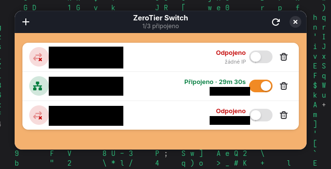

# ZeroTier Switch

Jednoduchá GTK4/libadwaita aplikace pro Fedoru (a jiné Linuxy s GTK4),
která nahrazuje chybějící oficiální GUI pro ZeroTier klienta.

Umožňuje:

- vidět všechny připojené ZeroTier sítě a jejich stav (připojeno / připojuje
  se / odpojeno), přidělenou IP a dobu připojení
- **zapnout/vypnout** konkrétní síť přepínačem — bez nutnosti `leave`/`join`
  (síť zůstává autorizovaná, jen se sundá/zvedne síťové rozhraní)
- **přidat síť** tlačítkem `+` zadáním Network ID
- **odebrat síť** (`leave`) tlačítkem koše, s potvrzením
- přiblížit/oddálit UI (`Ctrl` + kolečko myši, nebo `Ctrl` `+`/`-`/`0`)

## Screenshot



Design v barvách ZeroTier (oranžová/navy), stavové ikony zelená/červená
podle klasické konvence připojeno/odpojeno.

> Skutečný screenshot z běžící aplikace — jména sítí, Network ID a IP
> adresy jsou na obrázku začerněné (soukromé sítě autora), zbytek UI je
> beze změny.

## Jak to funguje

- `zerotier-cli listnetworks -j` čte stav sítí (bez `sudo` — viz níže)
- `zerotier-cli join/leave` přidává/odebírá členství v síti (bez `sudo`)
- zapnutí/vypnutí konkrétní sítě = `ip link set <rozhraní> up|down`
  (vyžaduje root, řeší se přes `pkexec` a malý helper skript)

## Instalace

Vyžaduje: `python3-gobject`, GTK4 + libadwaita (na běžné Fedora
Workstation už jsou), `zerotier-one`, `polkit`.

### 1. Zpřístupnit čtení stavu bez hesla

ZeroTier daemon drží `authtoken.secret` s právy `600 root:root`-like
(`zerotier-one:zerotier-one`). Aby appka mohla číst stav bez `sudo` při
každém refreshi, přidej se do skupiny `zerotier-one` a nastav trvalé
group-read právo na token:

```bash
sudo usermod -aG zerotier-one "$USER"

sudo mkdir -p /etc/systemd/system/zerotier-one.service.d
sudo tee /etc/systemd/system/zerotier-one.service.d/override.conf <<'EOF'
[Service]
ExecStartPost=/bin/bash -c 'sleep 2; chmod 640 /var/lib/zerotier-one/authtoken.secret; chgrp zerotier-one /var/lib/zerotier-one/authtoken.secret'
EOF

sudo systemctl daemon-reload
sudo systemctl restart zerotier-one
```

(Zpoždění `sleep 2` je nutné — ZeroTier daemon token přepíše krátce po
startu, takže `chmod` hned v `ExecStartPost` by byl přepsán zpět na `600`.)

Nové členství ve skupině se projeví až po relogu, proto launcher appky
používá `sg zerotier-one -c "..."` — funguje ihned i bez odhlášení.

### 2. Nainstalovat helper pro zapnutí/vypnutí rozhraní

```bash
sudo install -m 755 -o root -g root packaging/zerotier-toggle-helper \
    /usr/local/bin/zerotier-toggle-helper
```

Skript validuje vstup (`zt*` rozhraní, jen `up`/`down`) a přes `pkexec`
se pouští s heslem správce — hlídá se jen při přepnutí, čtení stavu
heslo nevyžaduje.

### 3. Nainstalovat appku a launcher

```bash
mkdir -p ~/.local/share/zerotier-switch
cp main.py ~/.local/share/zerotier-switch/

mkdir -p ~/.local/bin
cat > ~/.local/bin/zerotier-switch <<EOF
#!/bin/bash
exec sg zerotier-one -c "exec python3 \$HOME/.local/share/zerotier-switch/main.py"
EOF
chmod +x ~/.local/bin/zerotier-switch

mkdir -p ~/.local/share/applications
cp packaging/zerotier-switch.desktop ~/.local/share/applications/
sed -i "s#Exec=zerotier-switch#Exec=$HOME/.local/bin/zerotier-switch#" \
    ~/.local/share/applications/zerotier-switch.desktop
update-desktop-database ~/.local/share/applications/
```

Appka se pak objeví v App menu jako **ZeroTier Switch**.

## Klávesové zkratky

| Zkratka | Akce |
|---|---|
| `Ctrl` + kolečko myši | zoom UI |
| `Ctrl` `+` / `Ctrl` `-` | zoom in/out |
| `Ctrl` `0` | reset zoomu |

## Bezpečnostní poznámky

- Přístup ke čtení `authtoken.secret` dává appce (a komukoliv ve
  skupině `zerotier-one`) plný přístup k lokálnímu ZeroTier API —
  tedy i k `join`/`leave` bez hesla. To je záměr (pohodlí), ne chyba.
- Skutečné vypnutí/zapnutí síťového rozhraní (`ip link set`) je jediná
  akce vyžadující root a jde vždy přes `pkexec` s heslem správce.
- Helper skript striktně validuje, že se dá měnit jen rozhraní se
  jménem `zt*` — nelze jej zneužít na jiná síťová rozhraní v systému.

## Licence

MIT — viz [LICENSE](LICENSE). Volně k použití a úpravám.
